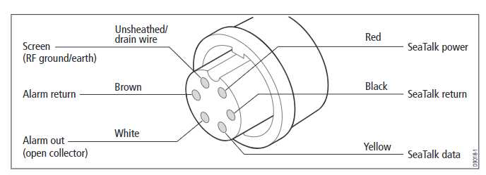
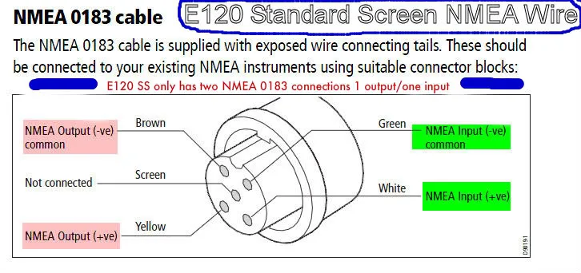
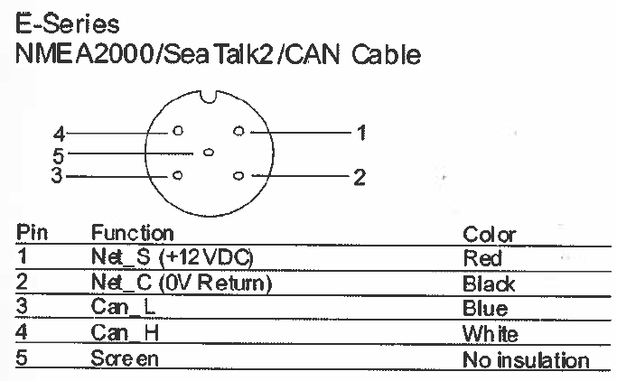

# Pinouts

## E80

### E80 "Seatalk/Alarm" cable pinout

Here is a diagram of the purported E80 Seatalk/Alarm cable pinout.
With regards to Seatalk, after detailed testing, I can tell you that the
diagram is, at best, misleading.

Clockwise, in the above diagram, starting at the notch

- red - Unconnected for Seatalk communications as the E80 is powered separately.
  Does not provide 12V in case you think it might.
  Not used in my configuration.
- **black** - The ground for the Seatalk serial Data signal.
  Must be provided as it is not internally connected to the
  E80 power supply negative (ship's DC ground).
- **yellow** - The bus for the Seatalk serial Data.
- white - Alarm out. Not used in my configuration.
- brown - Alarm return. Not used  in my configuration
- screen - RF ground/earth?  Not internally linked to the E80 power supply negative
  (ship's DC ground), not used in my configuration

In the end, the only two wires of interest for communicating Seatalk with the
E80 are the **black** data signal ground and **yellow** data bus.

### E80 NMEA0183 cable pinout

Here is a diagram of the E80's NMEA0183 cable pinout, which is the
same on the E120.

Clockwise, in the above diagram, starting at the notch

- **green** - NMEA Input Common - (minus)
  Used as common ground in single ended configurations like mine.
- **white** - NMEA Input + (plus)
  The E80 *receives* NMEA0183 on this wire
- **yellow** - NMEA Output + (plus)
  The E80 *sends* NMEA0183 on this wire.
- **brown** - NMEA Output Common - (minus)
  Duplicate of green?
  Not used in my configuration.
- screen - braided screen wire
  Grounded on E80?
  Not used in my configuration.

My system uses an MAX3232 RS232 converter to read NMEA0183, treating
the inputs as single ended, and connecting the **green** wire to the
common **GND** for the Teensy *and* the Boat's 12V power supply.

### E80 NMEA2000/Seatalk2 cable pinout

Here is a diagram of the purported E80 NMEA2000/Seatalk2 cable pinout.

Clockwise, in the above diagram, starting at the notch

- **red** - Net_S (+12V DC)
- **black** - Net_C (GND)
- **blue** - Can_L
- **white** - Can_H
- screen - braided; not connected on NMEA2000 bus side

## Standard Horizon GX2410GPS Cable Pinouts

### GX2410 NMEA0183 pigtail wires

The Standard Horizon documentation is horrible.
In the "Connections" section, instead of giving a clear description of each wire,
they give you a full page with two "connection examples" with superscripted notes
and a monkey-do list of how to hook it up with a confusing note.

There is a comment regarding grounding which is relevant, with
colors in asterisks added by me:

	NOTE: Some GPS chartplotters have a single wire for NMEA signal ground.
	In this case, connect the *green* NMEA input (-) to the GPS chartplotters
	single NMEA signal ground wire, and leave the *brown* NMEA output (-) open.

I have a common 12V ground and so ignore the rest of the comment:

	In case the assignment of power supply and ground of a GPS chart plotter
	to be used is different from that of the radio, connect the signal ground
	wire of the GPS chart plotter to the ground terminal (GND) on the rear
	panel of the radio.

####  Better names for GX2410 NMEA0183 wires

In truth, it appears that one pair of wires outputs GPS
information, another pair accepts GPS input information,
and the third pair outputs AIS information.

Standard Horizon's use of 'DSC' in the "Connections" section just
confuses things even more.  Here's a list that makes sense:

- **yellow** GPS Input +
- **green**  GPS Input -
- **white**  GPS Output +
- **brown**  GPS Output -
- **blue**   AIS Output +
- **grey**   AIS Output -

#### GX2410 Common Grounds and the E80

On my boat, historically, I generally connected just the
**blue/grey** AIS output to the **white/grean** NMEA0813 input on
the E80 to provide AIS information to the E80.

I have found that the E80 has a difficult time treating both
directions as a single ended pair with a common ground.  In other words
I have found that if you just use the **white/green/yellow** wires on
the E80, and try to connect the **grey/blue+green/white** from the VHF
to them, connecting the **blue** and the **green** from the VHF to provide
a common ground, that the E80 has a hard time differentiating the signal.

So, in a living boat configuration, if you wanted to connect in both
directions to the E80, you would connect the **green** E80 input - (minus)
to the VHF **grey** AIS out - (minus), and the **brown** E80 output - (minus)
to the VHF **green** GPS input - (minus).

TeensyBoat, on the other hand, has two (single ended) NMEA0183 ports, each
with input and output directions.  In my 'living boat' configuration of the
teensyBoat circuit board, I connect one of the NMEA0183 ports bi-directionally
to the E80, using the *green* common ground, and the other NMEA0183 port the
the VHF to both send (spoof) GPS information and receive (AIS) information.

Then there are two ways that I use the teensBoat circuit board.
In a 'live' configuration, that is where the teensy is powered up and
running, I place a jumper to use the combined **blue+green** ground on the VHF,
and forward messages between the E80 and the VHF.

When the teensy is not powered and running, allowind the E80 to receive AIS
information when it is not running, I switch the jumper to another position
that connects the VHS AIS output **blue** to the E80 NMEA0183 input **white**
and disconnect the VHF **green** GPS - (minus) from ground.

### GX2410 NMEA2000 Connector

The GX2410 uses a standard NMEA2000 Connector, so the one would expect
that the wires in a given table *should* follow the standard convention.

- **red** - Net_S (+12V DC)
- **black** - Net_C (GND)
- **blue** - Can_L
- **white** - Can_H
- screen - braided; not connected on NMEA2000 bus side

However, the cable that I cut open to begin working with my breadboard
NMEA2000 circuit had incorrect colors, so **beware**!  My cable has/had
white=12V, blue=GND, black=CAN_H, and grey=CAN_L, with an extra brown
wire that was not connected to anything.

## Raymarine RS125 GPS Puck Pinout

For better or worse I tried to to fix my RS125 GPS puck.
Of course it uses a proprietary connector, and of course there
is no information online about the pinout, so let me be the first.

Facing the connector on the cable, with the pin slot at the top,
the five pins, moving clockwise, correspond to the following five wires.

- **red** 		- 12V
- **braid** 	- GND
- **yellow**	- ST Data			or NMEA+
- **brown**		- DMC (differential GPS) unused
- **green**		- addl ST 12V		or NMEA-

Note that by connecting the green to 12V, you tell the puck to
transmit ST instead of NMEA0183

The brown is DMC for differential GPS, and is tied to GND
to prevent noise from generating erroneous signals.

## Seatalk 3 pin connectors

### Ideal Male, facing, slot at top

My terminology is the opposite of the industry standard.
In my terminology the male is actually the one that has "sockets" for
the pins on the "female", but which Inserts into the female.

Facing the male 3 pin Seatlk connector, with the slot at the top
you see a downwards pointing triangle.  Going clockwise the three
sockets, with idealized colors, are:

- 2 oclock =  12V **red**
- 6 oclock =  ST Data **yellow**
- 10 oclock = GND **black**

### Ideal Female facing, slot at top

Ergo, the female must be the opposite order

My terminology is the opposite of the industry standard.
In my terminology the female is actually the one that has "pins" but
because you insert the male into it, it is termed the female.

Facing the female 3 pin Seatlk connector, with the slot-pin at the top
you see a downwards pointing triangle.  Going clockwise the three
pins, with idealized colors, are:

- 2 oclock = GND **black**
- 6 oclock =  ST Data **yellow**
- 10 oclock =  12V **red**

### Defective Max Marine Female Pigtails

Over the years I have collected quite a few Seatalk cables
of varying pedigree and providance.

In general most of the ones that I currently have that are
Male to Female extensions, including ones I made, are known
to carry all three pins

I bought a pair of "ST50 3 Pin Round D127" female in my terminology,
male in theirs, pigtails from Max Marine Electronics that suprised me.
There are still 8 aailable.  The two I received were different, one
matched the ad photo, one didnt match the ad photo, but neither carried
the 6 oclock ST Data pin out to a conductor.  At best these are, as is,
"ST Power pigtails".

#### ST50 3 Pin Round D127 Max Marine cable that matched ad photo

Has a shiny thinner black cable with no writing, braid, yellow, and red.
The braid connects to GND, the red connects to 12V, but the yellow wire
does not appear to connect to the corresponding pin on the connector,
hence it is "defective" in my view.

I used this initially as a cable from the desk ST7000 to the teensyBoat pcb
and it didnt work.  Subsequent testing showed the yellow was not connected.

#### ST50 3 Pin Round D127 Max Marine cable that matched ad photo

Has a matte thicker cable labelled

	AWM 2464 E45681 LL54185 CSM AWM I/II A/B 80'C 300V FT-1

with braid, black and red, and red, where braid=GND, red=12V,
and black=NC, once again, being essentially a "defective"
Seatalk cable.

### Working Old Ray11 Female Pigtail

I have one more existing female pigtail, the old Ray11 removed
from Rhapsody with Yellow, Red, and Braid-in-white-heatshrink.
In this pigtail not only do the Red and Braid goto 12V and GND
as expected but the Yellow goes to the ST Data pin, so this
cable is considered functional.

